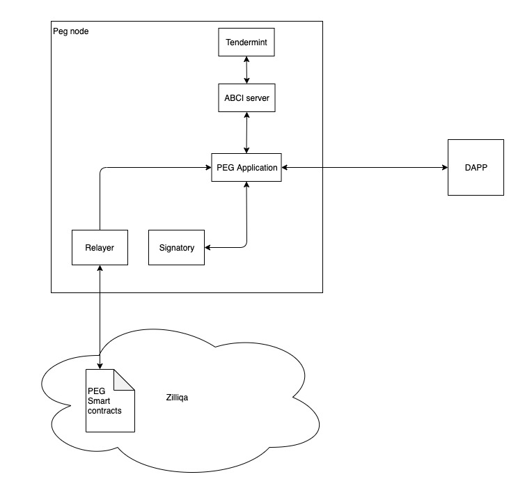

# Zilliqa Peg proof of concept

This proof of concept is using [LotionJS](https://lotionjs.com) framework.

## Project setup

### Requirements:
- node v7.6.0 or higher
- macos or linux (didn't test on windows)

### Insall dependencies:
```bash
npm install
```

## Start the project
- Start the peg zone blockchain
```bash
npm start
```

- Get current state
```bash
npm run state
```

- Do a transaction
```
npm test
```

## About the project


### What is done: 
- a blockchain with basic accounts support and one token
- simple transaction support between 2 accounts (without signature)

### What needs to be done:
- enhance accounts support (add nonce, add standard for address format, etc.)
- enhance transactions support (signature check, extra validations, etc.)
- IBC support [https://cosmos.network/docs/spec/ibc/](https://cosmos.network/docs/spec/ibc/)
- relay service
- signatory service
- running in a distributed way (more than 1 node)
- Zilliqa smart contracts (for blocking/unlocking tokens on Zilliqa chain)

## Useful links
- [Lotion JS](https://lotionjs.com/)
- [Nomic Bitcoin Peg](https://github.com/nomic-io/bitcoin-peg) based on LotionJS
- [Nomic Bitcoin Peg Testnet](https://github.com/nomic-io/nomic-testnet)
- [StakingHub: Cosmos Game of Zones AMA](https://figment.network/resources/staking-hub-cosmos-game-of-zones-ama/)
- [IBC Protocol specs](https://cosmos.network/docs/spec/ibc/)
- [Interchain Standards](https://github.com/cosmos/ics)
- [Gaia IBC Demo](https://github.com/cosmos/gaia/blob/cwgoes/ibc-demo-fixes/ibc-demo.md) (see also [ibc-demo.sh](https://github.com/cosmos/gaia/blob/cwgoes/ibc-demo-fixes/ibc-demo.sh))
